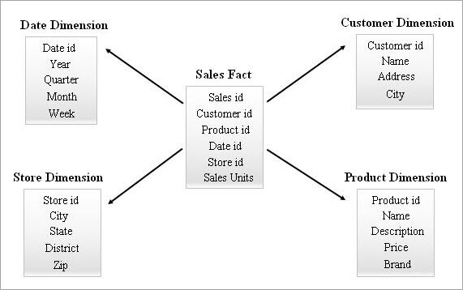

# SQL Database

## What is Schema

A schema is a collection of database objects, including tables, views, indexes etc.

## What is Fact table and Dimension table

### Fact Table

The fact table is a primary table in a dimensional model.

A fact Table contains

1. Measurements/facts
2. Foreign key to dimension table

The fact table contains measurements, metrics, and facts about a business process. The fact table is located at the center of a star or snowflake schema.

### Dimension Table

The dimension tables hold the descriptive information for all related fields that are included in the fact table's records. For example Customer, Product table.

### Difference between Fact and Dimension tables

1. Fact table contains, measurement, metrics or fact about a business process, while Dimension table is descriptive attributes to be used as a query constraining.

2. Fact table located at the center of a star or snowflake schema and surrounded by dimension tables. Dimension tables are connected to the fact table and located at the edge of the star or snowflake schema

3. Fact table could contain information like sales against a set of dimensions like Product and Date. While dimension table contains attributes which describe the details of the dimension. For ex, Product, Customer

4. Primary key in fact table is mapped as foreign keys to Dimensions. Dimension table has primary key columns that uniquely identifies each dimension.

## Types of Schemas

### 1. Star Schema:

A star schema contains one fact table in the middle and a number of associated dimension tables. The fact table maintains one-to-many relations with all the dimension tables. Every row in a fact table is associated with its dimension table rows with a foreign key reference.

Advantages: It is simple and easy to retrive data
Disadvantage: When there are many changes in the requirement, star schema is not recommended as data redundancy is more



### 2. SnowFlake Schema:

Snowflake schema is the nested version of star. Snow flaking is a process that completely normalizes all the dimension tables from a star schema. Fact table in the center surrounded by multiple hierarchies of dimension tables. While designing SnowFlake schemas the dimension tables are purposefully normalized. Foreign keys will be added to each level of the dimension tables to link to its parent attribute.

Advantages: Data redundancy is completelty removed by creating new dimension tables.
Disadvantages: Due to normalization of dimension tables, the ETL system has to load the number of tables.


# Database Normalization

### What is database normalization

Database normalization is the process of efficiently organizing data in a database. There are two reasons of the normalization process

- Eliminating redundant data, for example, storing the same data in more than one table
- Ensuring data dependencies make sense.

Normalization is a technique of organizing the data into multiple related tables, to minimize DATA REDUNDANCY.

Data redundancy means repeating same data multiple time which increase the size of database as well as create issues of maintaning such data. Following issues can be observed due to redundnacy.

- Insertion Anomaly: insert redundant data for every new row
- Deletion Anomaly: Loss of a related dataset when some other dataset is deleted
- Updation Anomaly: Updattion of data becomes more difficult and manual

## No Normlaization table


### 1NF - First Normal form

A relationship is in first normal form if every row can contain only one single (atomic) value.

1NF ensures there are no two same entries in a group. For a table to be in the first normal form, it should satisfy the following rules:

- Each cell should contain a single value attribute (atomic values)
- Each record should be unique


## 2NF - Second Normal Form

In a 2NF, all the subset of data that can be placed in multiple rows are placed in separate tables.

A relation is in 2NF if it is in 1NF and every non-key attribute is fully functionally dependent on the primary key.

Rule for 2NF

- Table should be in 1NF
- No partial dependency. All non-key attributes are fully functional dependent on the primary key.

Dependency or Functional dependency: All columns in a table are dependent on one primary key

Partial Dependency: When there are two or nore primary keys in one table ( Candidate Key). Any attribute depends only on a part of candidate key but not entire candidate key


## 3NF - Third Normal Form

A relationship is in 3NF if it is in 2NF and no non-key attributes is transitively dependent on the primary key.

3NF Rule

- Table should be in 2NF
- No Transitive dependency

Transitive dependency: non-primary key to non-primary key: When one column depends on a columnwhich is not primary key.


## SQL Commands

- DDL: CREATE, ALTER, DROP, TRUNCATE (mainly perform on tables)
- DML: INSERT, UPDATE, DELETE, MERGE (mainly perform on records)
- DCL (DATA CONTROL LANGUAGE): GRANT, REVOKE (granting authorization)
- TCL (TRANSACTION CONTROL LANGUAGE): COMMIT, ROLLBACK, SAVEPOINT (perform on transaction)
- DQL (DATA QUERY LANGUAGE): SELECT (for records)

## Candidate Key

A candidate key is any column or set of columns that can be used as a database's unique key.

## Primary Key

A primary key is a field in a table uniquely identifies each row/record in a database table. Primary keys must contains unique values.

A table can have only one primary key which may consist of single or multiple fields. When multiple fields are used as a primary key, they are called a 'composit key'

## Foreign Key

A foreign key ia a field (or collection of fields) in one table, that refers to the Primary Key in another table. The table with the foreign key is called the child table, and the table with the primary key is called the referenced or parent table.

## Candidate Key vs Primary Key

There can be more than one candidate key, while primary key is the most appropriate candidate key and it is only one.

for example,
consider the table

student_id, student_name, phone, address, dob

- Candidate Key: {student_id, phone}

There can be more than one candidate key.

While from above candidate key, student_id is the most promising key that describe as a primary key

## Indexing in DBMS

Indexing is a data structure technique which allows you to quickly retrieve records from a database file.

Indexing contain search key (primary key) and data reference (set of pointers holding address of the disk block)

The index file contains the index and its block location which is it pointing.

## Types of Indexing

- Primary
  - Dense: no of entries in the index table is same as the no. of entries in main table
  - Sparse: index records are not created for every search key. It is an index record that appears for only some of the values in the file.
- Clustering: A clustered index is an index which defines the physical order in which table records are stored in a database.
- Secondary: A secondary index is a data structure that contains a subset of attributes from a table, along with an alternate key to support query operations. It is two level indexes.

## ACID properties:

Transaction: A logical unit of work on a database. An action or series of actions that are being performed by a single user or applications program, which reads or update the context of the DB.

- Atomicity: The entire transaction takes place at once or doesn't happen at all.

For example, in an application that transfers funds from one account to another, the atomicity property ensures that, if a debit is made successfully from one account, the corresponding credit is made to the other account.

- Consistency: Data is in consistent state when a transaction starts and when it ends.

For example, in an application that transfers funds from one account to another, the consistency property ensures that the total value of funds in both the accounts is the same at the start and end of each transaction.

- Isolation: The intermediate state of transaction is invisible to other transactions. Multiple transaction can occur concurrently without leading to the inconsistency of database state.
  Transactions occur independently.

For example, in an application that transfers funds from one account to another, the isolation property ensures that another transaction sees the transferred funds in one account or the other, but not in both, nor in neither.

- Durability: After a transaction successfully completes, changes to data persist and are not undone, even in the event of system failure.

For example, in an application that transfers funds from one account to another, the durability property ensures that the changes made to each account will not be reversed.

## What is the difference between DELETE and TRUNCATE statement?

Delete can be used to remove either few or all the records from a table. Whereas truncate will always remove all the records from the table. Truncate cannot have WHERE condition

Delete is a DML statement hence we will need to commit the transaction in order to save the changes to database. Whereas truncate is a DDL statement hence no commit is required.

DELETE FROM employee;

TRUNCATE TABLE employee;

## Why do we use CASE Statement in SQL?

CASE statement is similar to IF ELSE statement from any other programming languages. We can use it to fetch or show a particular value based on certain condition.

## What is the difference between LEFT, RIGHT, FULL outer join and INNER join?

- Inner Join: INNER JOIN will fetch only those records which are present in both the joined tables.

- Left Join: LEFT JOIN will fetch all records from the left table (table placed on the left side during the join) even if those records are not present in right table (table placed on the right side during the join).

- Right Join: RIGHT JOIN will fetch all records from the right table (table placed on the right side during the join) even if those records are not present in left table (table placed on the left side during the join).

- Full Join: FULL JOIN will fetch all records from both left and right table.

- Self Join: SELF JOIN is when you join a table to itself.

## What is the difference between DISTINCT and GROUP BY?

- DISTINCT clause will return unique column values.

SELECT DISTINCT name FROM employee;

- GROUP BY clause will group together the data based on the columns specified in group by. Which will then return just one record for each unique value in the column specified in group by.

SELECT name, COUNT(1) FROM employee GROUP BY name;

## What is the difference between RANK, DENSE_RANK and ROW_NUMBER window function?

- RANK: RANK() function will assign a rank to each row within each partitioned result set. If multiple rows have the same value then each of these rows will share the same rank.

- DENSE_RANK: DENSE_RANK() function will assign a rank to each row within each partitioned result set. If multiple rows have the same value then each of these rows will share the same rank.

However the dense_rank of the following (next) rows will NOT get skipped. This is the only difference between rank and dense_rank. RANK() function skips a rank if there are duplicate rows whereas DENSE_RANK() function will never skip a rank.

- ROW_NUMBER: ROW_NUMBER() function will assign a unique row number to every row within each partitioned result set. It does not matter if the rows are duplicate or not.

## What are subqueries? Where can we use them?

A SELECT query statement which is placed inside another SELECT query is termed as a subquery. Subquery can also be termed as inner query.

## What is a trigger?

Trigger is a database object which is similar to a stored procedure which will automatically get invoked or executed when the specified event occurs in the database.

DML triggers are invoked when a DML operation (INSERT, UPDATE, DELETE) occurs on the respective table (table on which the trigger was created).

## What is MERGE statement?

Merge is part of the DML commands in SQL which can be used either perform INSERT or UPDATE based on the data in the respective table.

If the desired data is present then merge will update the records. If desired data is not present then merge will insert the records.

```
MERGE INTO managers m

USING directors d ON (m.id = d.id)

WHEN MATCHED THEN

      UPDATE SET name = 'TEST'

WHEN NOT MATCHED THEN

      INSERT VALUES (d.id, d.name, 0);
```

## Which function can be used to fetch yesterdays date? Provide example.

- ORACLE: SELECT SYSDATE - 1 as previous_day FROM DUAL;
- MySql: SELECT DATE_SUB(SYSDATE(), INTERVAL 1 DAY) as previous_day;
- MSSQL: SELECT DATEADD(DAY, -1, GETDATE());

## What is the difference between a function and a procedure?

- Function should always return a value whereas for a procedure it’s not mandatory to return a value.

- Function can be called from a SELECT query whereas procedure cannot be called from a SELECT query.

- Function is generally used to perform some calculation and return a result. Whereas procedure is generally used to implement some business logic.
