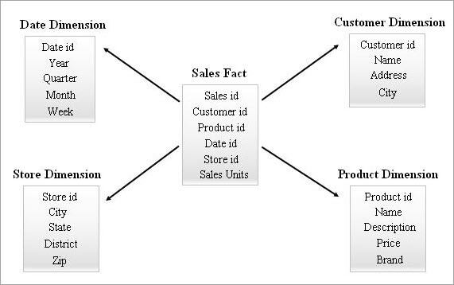

# SQL Database

## What is Schema

A schema is a collection of database objects, including tables, views, indexes etc.

## What is Fact table and Dimension table

### Fact Table

The fact table is a primary table in a dimensional model.

A fact Table contains

1. Measurements/facts
2. Foreign key to dimension table

The fact table contains measurements, metrics, and facts about a business process. The fact table is located at the center of a star or snowflake schema.

### Dimension Table

The dimension tables hold the descriptive information for all related fields that are included in the fact table's records. For example Customer, Product table.

### Difference between Fact and Dimension tables

1. Fact table contains, measurement, metrics or fact about a business process, while Dimension table is descriptive attributes to be used as a query constraining.

2. Fact table located at the center of a star or snowflake schema and surrounded by dimension tables. Dimension tables are connected to the fact table and located at the edge of the star or snowflake schema

3. Fact table could contain information like sales against a set of dimensions like Product and Date. While dimension table contains attributes which describe the details of the dimension. For ex, Product, Customer

4. Primary key in fact table is mapped as foreign keys to Dimensions. Dimension table has primary key columns that uniquely identifies each dimension.

## Types of Schemas

### 1. Star Schema:

A star schema contains one fact table in the middle and a number of associated dimension tables. The fact table maintains one-to-many relations with all the dimension tables. Every row in a fact table is associated with its dimension table rows with a foreign key reference.

Advantages: It is simple and easy to retrive data
Disadvantage: When there are many changes in the requirement, star schema is not recommended as data redundancy is more

### 2. SnowFlake Schema:

Snowflake schema is the nested version of star. Snow flaking is a process that completely normalizes all the dimension tables from a star schema. Fact table in the center surrounded by multiple hierarchies of dimension tables. While designing SnowFlake schemas the dimension tables are purposefully normalized. Foreign keys will be added to each level of the dimension tables to link to its parent attribute.

Advantages: Data redundancy is completelty removed by creating new dimension tables.
Disadvantages: Due to normalization of dimension tables, the ETL system has to load the number of tables.

[alt text](snow_flake.png "Snow Flak")
